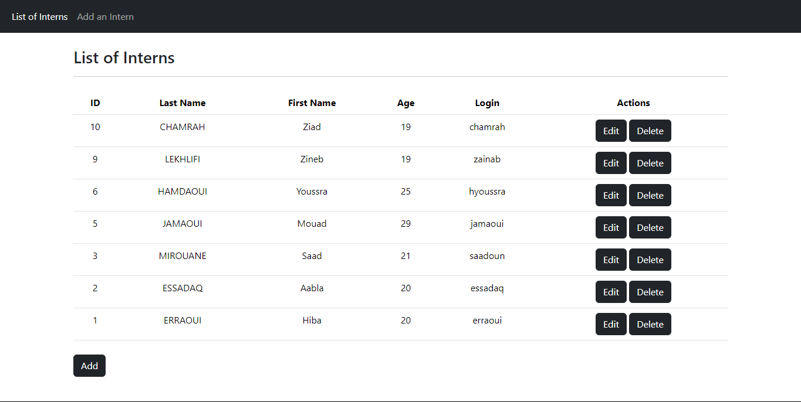
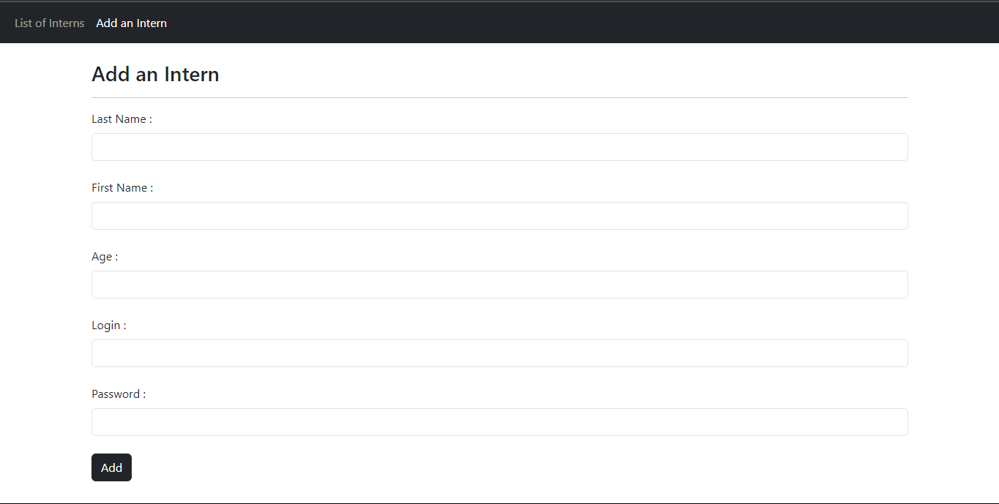
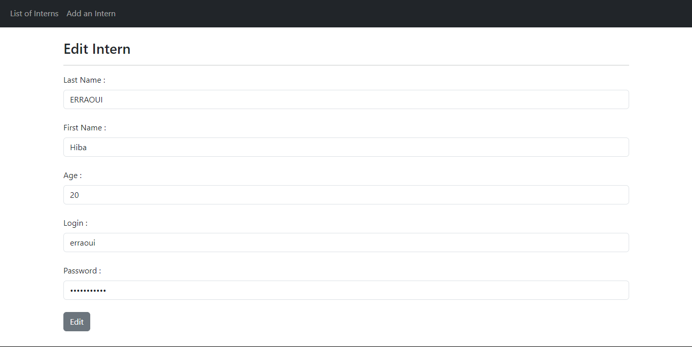
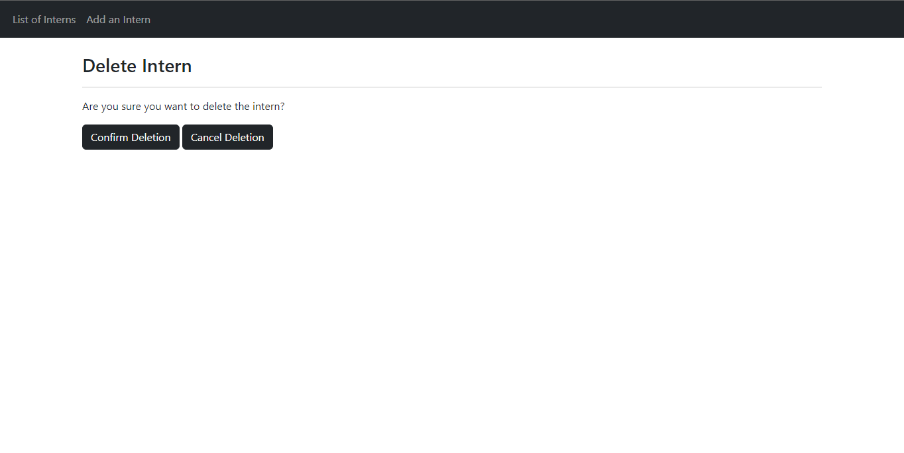

## Description
A PHP project showcasing the MVC (Model-View-Controller) architecture for managing intern data with CRUD (Create, Read, Update, Delete) operations. This project provides a simple yet comprehensive example of how to structure a web application using PHP, MySQL, and the MVC pattern.

## Features
♡ &nbsp; View Interns: Browse a list of interns with their details such as last name, first name, age, and login.  
♡ &nbsp; Add Interns: Add new interns to the database with all required information.  
♡ &nbsp; Edit Interns: Modify the details of existing interns, such as their name, age, or login credentials.  
♡ &nbsp; Delete Interns: Remove interns from the database if they are no longer needed.  

## Screenshots

